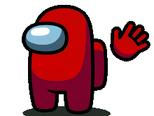
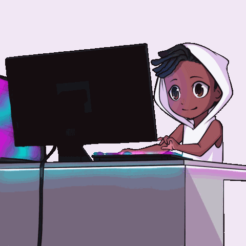

<div align="center">
  <table>
    <tr>
      <td>
        <h1>Hi, I'm Roshan</h1>
      </td>
      <td>
        
      </td>
    </tr>
  </table>
</div>

<p align="center">
  Full-stack developer and student who enjoys building useful products, understanding systems deeply, and learning by shipping.
</p>

## About Me

I’m Roshan, a student developer working across web development, programming, and graphics. I like building projects that improve my fundamentals while also creating something people can actually use.

```txt
Role       : Student Developer & Learner
Location   : India
Languages  : C++, Python, JavaScript, TypeScript
Tech Stack : React, Node.js, Express, MongoDB, Firebase
Tools      : Git, Linux, VS Code, Neovim, Bash
Philosophy : Build. Learn. Ship. Repeat.
```

---

## Portfolio

<p align="center">
  My portfolio is the best place to see what I’m building, how I think about projects, and the kind of work I want to keep doing.
</p>

<p align="center">
  <a href="https://roshansoni.netlify.app">
    
  </a>
</p>

<p align="center">
  <a href="https://roshansoni.netlify.app"><strong>roshansoni.netlify.app</strong></a>
</p>


> **Current Focus**
>
> Full Stack Web Development • Programming & System Design • Game Development with C++ • AI / Machine Learning

---

## Tech Stack

### Languages
<p align="center">
  <a href="https://skillicons.dev">
    
  </a>
</p>

### Frontend
<p align="center">
  <a href="https://skillicons.dev">
    
  </a>
</p>

### Backend
<p align="center">
  
</p>

### Database & Backend Services
<p align="center">
  <a href="https://skillicons.dev">
    
  </a>
</p>

### Development Tools
<p align="center">
  
</p>

### Game Development
<p align="center">
  
</p>

## GitHub Activity

<div align="center">

[](https://github.com/roshansoni-io)

[](https://git.io/streak-stats)


</div>

---

## Learning & Growth

### Currently learning
- **System Design** – Scalability, databases, distributed systems
- **Machine Learning** — PyTorch, scikit-learn
- **Computer Graphics** — OpenGL

<p align="center">
  I like working across product and fundamentals: building web apps, studying how systems behave under load,
  and improving my understanding of graphics, low-level programming, and applied machine learning.
</p>

<div align="center">
  
</div>


## Get in Touch

<p align="center">
  Open to collaboration, interesting builds, and thoughtful conversations.
</p>

<p align="center">
  <a href="https://roshansoni.netlify.app">
    
  </a>
  <a href="https://github.com/roshansoni-io">
    
  </a>
  <a href="mailto:roshan.soniin@gmail.com">
    
  </a>
</p>

<p align="center">
  Portfolio • GitHub • Email
</p>

---

<div align="center">
  
</div>
